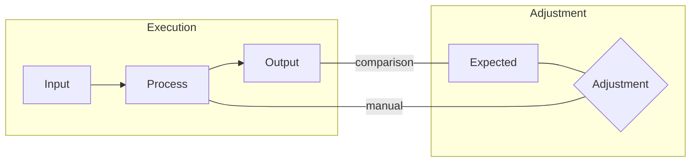

# IPOA Model in Mathematics and Programming

The Input-Process-Output-Adjustment (IPOA) model is a framework that captures the essence of problem-solving and implementation in both mathematics and programming. This model is characterized by an iterative process of defining functions, testing them, and adjusting as needed to achieve the desired outcome.

## Workflow
`IPOA Workflow` is segmented in 2 main process:
- Execution: The process of our function that takes the `input` (`I`), applies the `process` (`P`) and generates the `output` (`O`).
- Adjustment: The process where if the `output` is not the `expected`, we manually apply an `adjustment` (`A`) the `process` of our function. Acts as feedback



<br>

---

<br>

## Case Study: The Function $\frac{1}{1 + n}$

Let's consider the function $f(n) = \frac{1}{1 + n}$ to illustrate the IPOA model.

---

## Mathematics Perspective

### Execution
- **`Input` (`n`)**: In mathematics, the input is a value or set of values for which the function is evaluated. For our example, `n` is the input.

- **`Process` (Function Definition)**: The process is the mathematical operation defined by the function. In our case, $f(n) = \frac{1}{1 + n}$.

- **`Output`**: The output is the result of applying the function to the input. For example, $f(1) = \frac{1}{2}$.

### Adjustment
- **`Adjustment` (Refinement)**: If the function does not behave as desired (e.g., producing undefined or undesirable values), it can be adjusted. For instance, ensuring the denominator is never zero to avoid undefined outputs.

Example Function Table:
| X (input) | Y (output) |
|-----------|------------|
| -1        | undefined  |
| 0         | 1          |
| 1         | 0.5        |

With `adjustment` (A) we can redefine the function to avoid undefined outputs. Pierre Francios Verhulst design the following function called `sigmoid` where it introduces the `e` constant (Euler's number) and the `x` variable (input). This avoids undefined outputs and produces a smooth curve.

$f(n) = \frac{1}{1 + e^{-x}}$

| X (input) | Y (output) |
|-----------|------------|
| -1        | 0.26894142 |
| 0         | 0.5        |
| 1         | 0.73105858 |

<br>

---

<br>

## Programming Perspective

### Execution
- **`Input` (Function Arguments)**: In programming, inputs are the arguments passed to a function. For our function, `n` would be the argument.

```python
def f(n):
    return 1 / (1 + n)
```

- **`Process` (Function Implementation)**: This involves coding the function to perform the intended computation.

- **`Output` (Return Value)**: The output is what the function returns when called with specific arguments. For example, `f(1)` returns `0.5`.

### Adjustment
- **`Adjustment` (Testing and Refining)**: This is akin to `Test-Driven Development` (TDD) in software. We write tests to define expected outputs for given inputs and refine the function until it passes all tests.

```python
assert f(1) == 0.5  # Test case
```

<br>

---

<br>

### Iterative Refinement in Both Domains

- **Iterative Process**: Both in mathematics and programming, the process involves iteratively refining the function or code based on the results it produces (output) and the expectations or requirements (tests or mathematical properties).

- **Problem-Solving and Validation**: The IPOA model emphasizes a cycle of problem-solving (defining the function or code) and validation (testing with values or test cases).

<br>

---

<br>

### Conclusion

The IPOA model demonstrates a fundamental similarity in the approach to problem-solving in mathematics and programming. It underscores the iterative nature of developing and refining functions, whether they are mathematical expressions or blocks of code, guided by a cycle of input, processing, output, and adjustment.