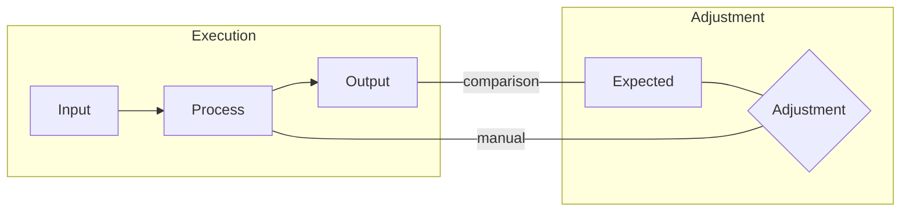
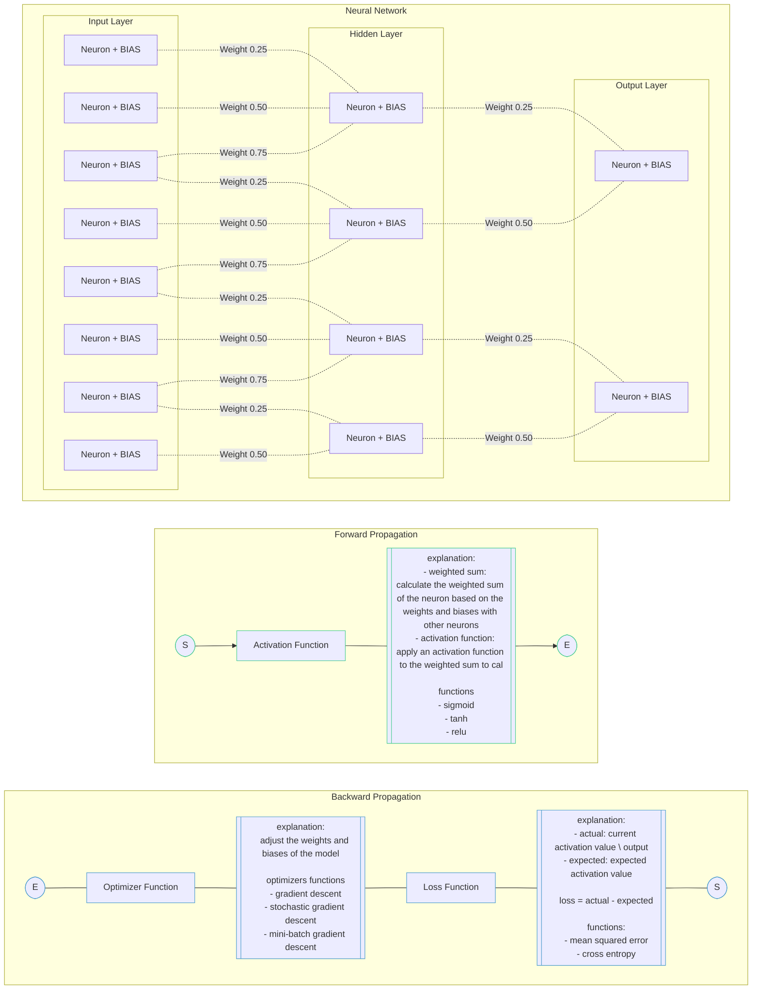

# Functions and I-P-O-A Workflow
## Functions
In programming languages such as C++, Rust, Golang, Python, NodeJS, etc, functions are blocks of code that perform a specific task. This allows to encapsulate code and reuse it in different parts of the program. It helps with the principles of DRY (Don't Repeat Yourself) and KISS (Keep It Simple Stupid).

**Elements**
- Input: The input of the function. It can be zero or more parameters.
- Process: The logic of the function that performs the task (based on the input)
- Output: The output of the function. It can be zero or more parameters.

**Advantages**
- SRP: Functions help to follow the Single Responsibility Principle. Each function should perform a single task.
- Reusability: Functions can be reused in different parts of the program.
- Modularity: Functions can be used to break down a complex program into smaller and simpler modules.
- Abstraction: Functions can be used to hide the implementation details of a program.
- Maintainability: Functions help to make the code more readable and maintainable.

**Declaration**
> JavaScript (ES6)
```js
// Function declaration
function functionName(parameter1, parameter2, ...) {
  // Code to be executed
}
```

> Python
```py
# Function declaration
def functionName(parameter1:str, parameter2:str, ...):
  # Code to be executed
```

> Golang
```go
// Function declaration
func functionName(parameter1, parameter2 string) (return1, return2 string) {
    // Code to be executed
    return "return1", "return2"
}
```

## Testing
Testing is the process of evaluating a system or its component(s) with the intent to find whether it satisfies the specified requirements or not. Testing is executing a system in order to identify any gaps, errors, or missing requirements in contrary to the actual requirements.

**Unit Testing**
Unit testing is a software testing method by which individual units of source code are tested to determine whether they are fit for use. A unit is the smallest testable part of any software. This units could be considered as `functions`, `methods`, `classes`, etc.


**Test Driven Development (TDD)**
There is a methodology called TDD (Test Driven Development) that consists of writing the tests before the code. This helps to write the code with a clear goal in mind and to avoid over-engineering. With TDD we can `adjust` the `process` of our `functions` so they can produce the `output` that we expect.

TDD is the key point where we `manually` adjust the process of our `functions` so with the base `input`, we generate the `output` that we expect. Its a mechanism of `adjustment` of our functions.

## I-P-O-A Workflow
**Static/Declarative Approach**
We can see a pattern in this process of `adjustment` of our functions. There are 2 main process:
- **Execution**: The process of our function that takes the `input` (`I`), applies the `process` (`P`) and generates the `output` (`O`).
- **Adjustment**: The process where if the `output` is not the `expected`, we manually apply an `adjustment` (`A`) the `process` of our function. Acts as feedback

Here a diagram of this process:


**Dynamic Approach**
We can stablish a parallelism between this process and what `neural networks`, with the difference, this `adjustment` is done not `manually` but `dynamically`
- **Forward Propagation**: The process of our neural network that takes the `input`, applies the `process` (vía `activation functions`) and generates the `output`.
- **Backwards Propagation**: The process where if the `output` is not the `expected` (based on the `loss function`) we dynamically adjust the `process` of our neural network (vía `weights` and `biases`). Acts as feedback.

Here is a diagram in mermaid.js that illustrates all the components of a neural network:
