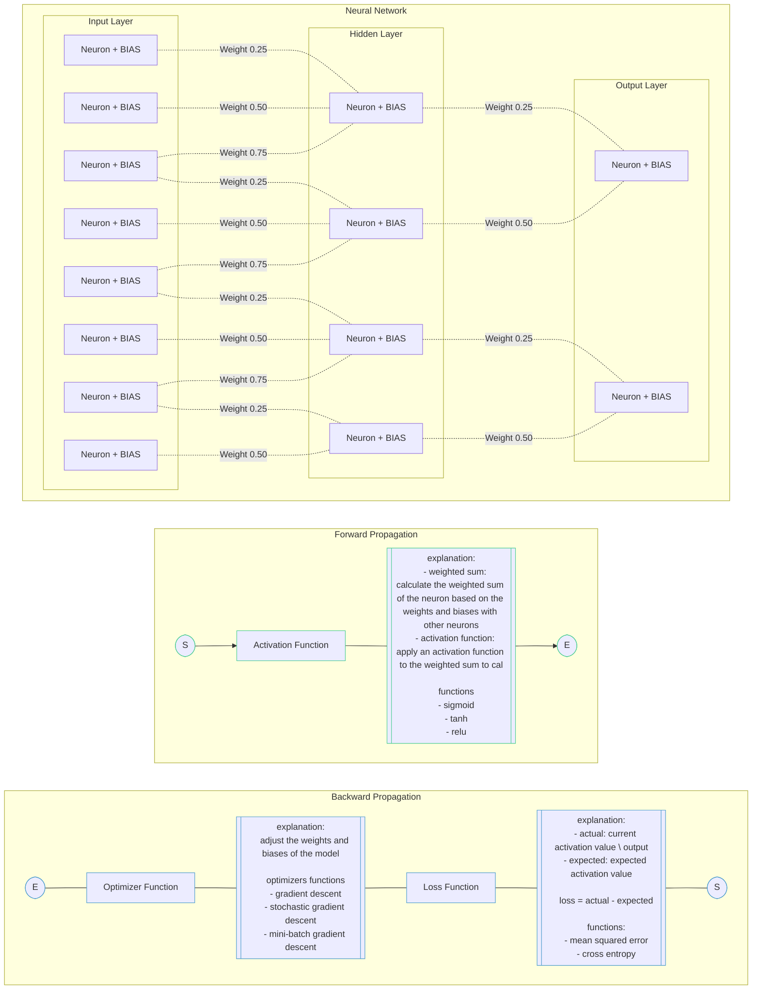

```mermaid
graph LR
%% Backward Propagation
%% - Entities
I_BP([S]):::style_bp
E_BP([E]):::style_bp
Loss_Function[Loss Function]:::style_bp
Loss_Function_Explained[["
    explanation:
    - actual: current activation value \ output
    - expected: expected activation value
    
    loss = actual - expected

    functions:
    - mean squared error
    - cross entropy
"]]:::style_bp
Optimizer_Function[Optimizer Function]:::style_bp
Optimizer_Function_Explained[["
    explanation:
    adjust the weights and biases of the model

    optimizers functions
    - gradient descent
    - stochastic gradient descent
    - mini-batch gradient descent
"]]:::style_bp

%% - Subgraph
subgraph BACKWARD_PROPAGATION[Backward Propagation]
    direction LR
    I_BP
    E_BP
    Loss_Function
    Loss_Function_Explained
    Optimizer_Function
    Optimizer_Function_Explained
end

%% - Connections
E_BP --- Optimizer_Function
Optimizer_Function --- Optimizer_Function_Explained
Optimizer_Function_Explained --- Loss_Function
Loss_Function --- Loss_Function_Explained
Loss_Function_Explained --- I_BP


%% Forward Propagation
%% - Entities
I_FP([S]):::style_fp
E_FP([E]):::style_fp
Activation_Function[Activation Function]:::style_fp
Activation_Function_Explained[["
    explanation:
    - weighted sum: calculate the weighted sum of the neuron based on the weights and biases with other neurons
    - activation function: apply an activation function to the weighted sum to cal

    functions
    - sigmoid
    - tanh
    - relu
"]]:::style_fp

%% - Subgraph
subgraph FORWARD_PROPAGATION[Forward Propagation]
    direction LR
    I_FP
    E_FP
    Activation_Function
    Activation_Function_Explained
end

%% - Connections
I_FP --> Activation_Function
Activation_Function --- Activation_Function_Explained
Activation_Function_Explained --> E_FP

%% Neural Network Model
%% - Components / Entities
N1_LYI[Neuron + BIAS]
N2_LYI[Neuron + BIAS]
N3_LYI[Neuron + BIAS]
N4_LYI[Neuron + BIAS]
N5_LYI[Neuron + BIAS]
N6_LYI[Neuron + BIAS]
N7_LYI[Neuron + BIAS]
N8_LYI[Neuron + BIAS]

N1_LYH[Neuron + BIAS]
N2_LYH[Neuron + BIAS]
N3_LYH[Neuron + BIAS]
N4_LYH[Neuron + BIAS]

N1_LYO[Neuron + BIAS]
N2_LYO[Neuron + BIAS]

%% - Subgraph
subgraph NEURAL_NETWORK[Neural Network]
    direction LR
    subgraph INPUT_LAYER[Input Layer]
        N1_LYI
        N2_LYI
        N3_LYI
        N4_LYI
        N5_LYI
        N6_LYI
        N7_LYI
        N8_LYI
    end

    subgraph HIDDEN_LAYER[Hidden Layer]
        N1_LYH
        N2_LYH
        N3_LYH
        N4_LYH
    end

    subgraph OUTPUT_LAYER[Output Layer]
        N1_LYO
        N2_LYO
    end
end

%% - Connections
%% Synapses
N1_LYI -..-|Weight 0.25| N1_LYH
N2_LYI -..-|Weight 0.50| N1_LYH
N3_LYI -..-|Weight 0.75| N1_LYH

N3_LYI -..-|Weight 0.25| N2_LYH
N4_LYI -..-|Weight 0.50| N2_LYH
N5_LYI -..-|Weight 0.75| N2_LYH

N5_LYI -..-|Weight 0.25| N3_LYH
N6_LYI -..-|Weight 0.50| N3_LYH
N7_LYI -..-|Weight 0.75| N3_LYH

N7_LYI -..-|Weight 0.25| N4_LYH
N8_LYI -..-|Weight 0.50| N4_LYH

N1_LYH -..-|Weight 0.25| N1_LYO
N2_LYH -..-|Weight 0.50| N1_LYO

N3_LYH -..-|Weight 0.25| N2_LYO
N4_LYH -..-|Weight 0.50| N2_LYO

%% Styles
classDef style_fp stroke:#4bcc94
classDef style_bp stroke:#4b9bcc
```